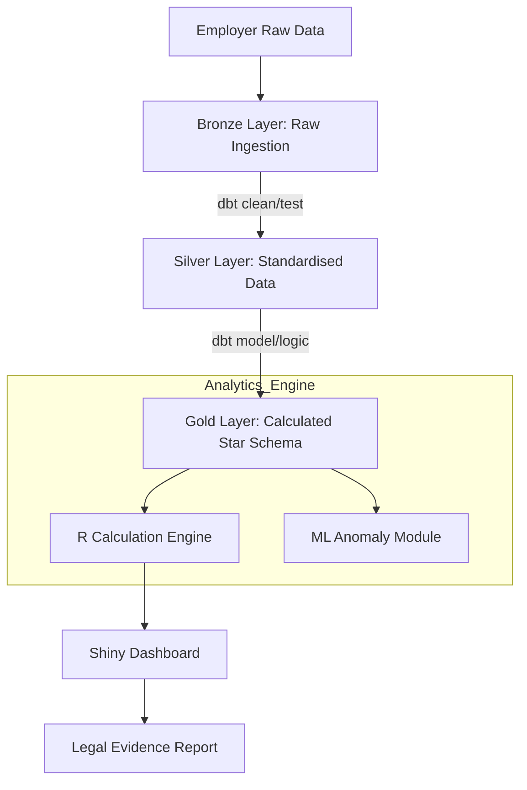

# Solution Design Document (SDD)
## Project: FACT (FWO Entitlement Analysis & Compliance Tool)

---

## 1. Document Control

**Document Title:** FACT — Solution Design Document  
**Version:** 1.1.0  
**Date:** 2024-05-22  
**Author(s):** B. Kim  
**Reviewer(s):** Analytics & Intelligence Branch Lead  
**Approver(s):** Regulatory Transformation Group Director  

| Version | Date | Description |
|--------|------|------------|
| 1.0.0 | 2024-05-22 | Initial architecture for Award-based Wage Analysis System |
| 1.1.0 | 2024-05-22 | Integrated **dbt** and **Medallion Architecture** for structured ingestion |

---

## 2. Executive Summary

### Technical Stack
- **Frontend/UI:** R Shiny (Interactive Analytics Dashboard)
- **Transformation Layer:** **dbt (data build tool)** for modular SQL modeling & testing
- **Backend/Engine:** R (Tidyverse) for reactive logic & Python (XGBoost/Isolation Forest) for ML
- **Database:** Azure SQL Database / Snowflake (**Medallion Architecture**)
- **Infrastructure:** Azure Cloud (Government Tenant)
- **Version Control:** Git / GitHub Actions (CI/CD)

### Purpose
This document outlines the design for the **FACT System**, an automated engine designed to integrate diverse employer timesheet data, model complex Modern Award logic, and calculate underpayments for regulatory enforcement using a transparent and auditable data pipeline.

---

## 3. Business Context

### Problem Statement
Current wage investigations are slowed by inconsistent data formats and the high complexity of the Fair Work Act's Awards. Manual calculations lack a "Chain of Custody" for data transformations, making them difficult to defend in litigation.

### Objectives
- **Precision:** Deliver 100% accurate wage calculations suitable for court evidence.
- **Auditability:** Every transformation step must be version-controlled and reproducible via dbt.
- **Efficiency:** Reduce investigation turnaround time by 50% via automated Medallion pipelines.
- **Flexibility:** Ensure **Rule Extensibility** to allow Award updates without code changes.

---

## 4. Functional Requirements

| ID | Requirement | Description | Priority |
|----|------------|-------------|----------|
| FR-01 | Data Normalization | Standardise disparate CSV/Excel timesheets into a unified Fact table. | High |
| FR-02 | Medallion Ingestion | Implement Bronze (Raw), Silver (Cleaned), and Gold (Calculated) layers. | High |
| FR-03 | Award Logic Engine | Apply specific rules: Base rates, Penalties, Overtime, and Breaks via dbt. | High |
| FR-04 | Gap Analysis | Calculate the delta between 'Expected Pay' and 'Actual Paid'. | High |
| FR-05 | What-if Simulation | Allow users to adjust Levels/Rates in UI and see real-time impact. | Medium |
| FR-06 | Fraud Detection | Identify "too-perfect" records using ML (Isolation Forest). | Medium |

---

## 5. Non-Functional Requirements

| Category | Requirement |
|----------|------------|
| Performance | Process 1,000,000+ records in under 10 seconds. |
| Scalability | Support star-schema joins for large-scale enterprise audits (10k+ staff). |
| Reliability | Provide a full audit trail via dbt/Git for every cent calculated (Calculation Lineage). |
| Security | Adhere to AGSVA Baseline Security standards; PII Data Masking. |
| Transparency | Provide dbt-generated documentation for legal review of business logic. |

---

## 6. High-Level Architecture (Medallion + dbt)

### 6.1 System Overview
The FACT system follows a modular pipeline utilizing **Medallion Architecture** and **dbt**:
- **Data Ingestion (Bronze):** Captures raw data "as-is" to preserve the legal source of truth.
- **Transformation (Silver):** Cleanses, validates, and standardizes data formats.
- **Structured Storage (Gold/Star Schema):** Houses the final curated analytics tables.
- **Computation (R/Python Engine):** Executes high-speed entitlement modeling and ML scanning.
- **Presentation (Shiny):** Provides an interactive forensic interface for investigators.

### 6.2 Data Flow
1. **Ingestion (Bronze):** Raw employer data is stored with immutable timestamps.
2. **Standardization (Silver):** dbt models handle type casting and map records to **Dimension Tables**.
3. **Calculation (Gold):** The Engine applies Award rules at a **Daily Granularity** within the Gold Layer star schema.
4. **Export:** Results are visualized in Shiny and exported as PDF/Excel for litigation support.

### 6.3 Key Components
| Component | Description |
| ----------- | ----------- |
| **dbt Tests** | Acts as the Ingestion Validator, flagging schema errors or data integrity breaches. |
| **Compliance Engine** | Vectorized R logic and dbt SQL models for high-speed entitlement modeling. |
| **Anomaly Scanner** | Unsupervised ML module to detect data manipulation patterns. |

---

## 7. Detailed Design

### 7.1 Data Modeling (Star Schema in Gold Layer)
*   **Fact_Timesheets:** Daily-level records (emp_id, date, start, end, actual_paid).
*   **Dim_Awards:** Award metadata (thresholds, break rules, daily allowances).
*   **Dim_PayRates:** Normalized rates (award_id, level, day_type, base_rate, multiplier).

### 7.2 Entitlement Module (The Engine)
*   **Responsibility:** Calculate `Expected_Pay` based on legal rules.
*   **Input:** Normalized Silver/Gold Layer tables + Award Dimensions.
*   **Output:** Calculated Daily Underpayment + Status (Compliant/Breach).

### 7.3 State Management
FACT uses a reactive state pattern in R Shiny. While the Gold Layer provides the baseline calculation, the Shiny app allows investigators to perform real-time overrides (e.g., changing an employee's Level) in-memory for instant "What-if" analysis.

### 7.4 API / Export Design
| Method | Endpoint / Format | Description |
| ------ | ------------ | ----------- |
| DOWNLOAD | .xlsx / .pdf | Detailed breakdown of calculations for court evidence. |
| POST | /api/v1/analyze | (Internal) Endpoint for batch processing multiple businesses. |

---

## 8. Security Design

*   **Auth/Access:** Integrated with Azure Active Directory (RBAC).
*   **Data Protection:** TDE (Transparent Data Encryption) for data at rest; TLS 1.2 for transit.
*   **Anonymization:** PII is masked in the analytics layer; dbt provides clear lineage while protecting sensitive IDs.
*   **Audit Trail:** Every dbt model change is versioned in Git; Shiny logs every user interaction with a timestamp.

---

## 9. Error Handling & Fallbacks

| Scenario | Handling Strategy |
| -------- | ----------------- |
| **dbt Test Failure** | Stop promotion to Silver/Gold; generate "Data Quality Breach" report. |
| **Schema Mismatch** | Ingestion validator catches drift in Bronze; alerts Data Analyst immediately. |
| **Rule Ambiguity** | Apply the most beneficial rate to the employee; flag for manual forensic review. |
| **Engine Timeout** | Switch to asynchronous background processing; notify user via email. |

---

## 10. Observability & Monitoring

*   **dbt Documentation:** Auto-generated lineage and data dictionary used for legal auditability.
*   **Logging:** All calculation steps are logged to a `FACT_Audit_Log` table.
*   **Metrics:** Tracking "Total Underpayment Detected" and "Processing Latency" via dbt run-results.
*   **Health Check:** Heartbeat monitoring for the R/Python runtime environments.

---

## 11. Future Enhancements (Roadmap)

### Short Term
*   **NLP Rule Extraction:** Use RAG (Retrieval-Augmented Generation) to parse PDF Enterprise Agreements into `Dim_Awards` data.
*   **dbt Semantic Layer:** Define metrics once in dbt to ensure consistency across all FWO reporting tools.

### Long Term
*   **Predictive Enforcement:** Use XGBoost to identify industries with a high risk of systemic wage theft before complaints are filed.
*   **Collaborative Investigation:** Multi-user workspace for large-scale litigation teams to annotate data.
