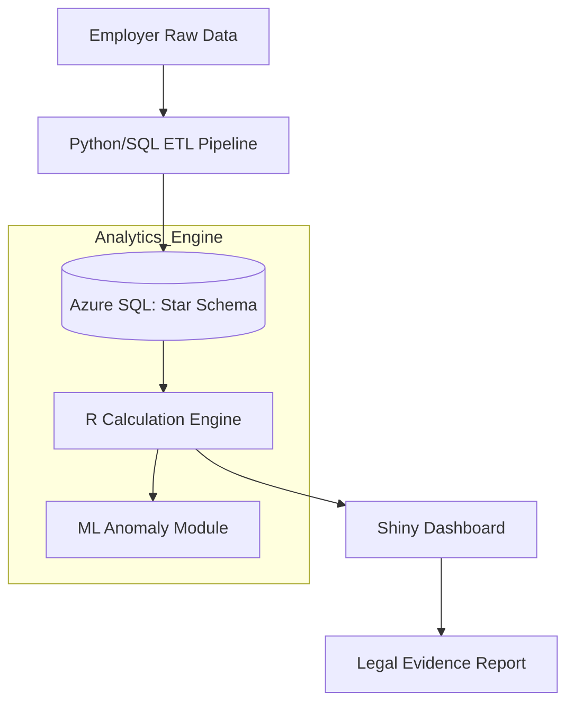

# Solution Design Document (SDD)
## Project: FACT (FWO Entitlement Analysis & Compliance Tool)

---

## 1. Document Control

**Document Title:** FACT — Solution Design Document  
**Version:** 1.0.0  
**Date:** 2024-05-22  
**Author(s):** B. Kim  
**Reviewer(s):** Analytics & Intelligence Branch Lead  
**Approver(s):** Regulatory Transformation Group Director  

| Version | Date | Description |
|--------|------|------------|
| 1.0.0 | 2024-05-22 | Initial architecture for Award-based Wage Analysis System |

---

## 2. Executive Summary

### Technical Stack
- **Frontend/UI:** R Shiny (Interactive Analytics Dashboard)
- **Backend/Engine:** R (Tidyverse) for core logic & Python (Scikit-learn/XGBoost) for ML
- **Database:** Azure SQL Database / Snowflake (Star Schema)
- **Infrastructure:** Azure Cloud (Government Tenant)
- **Version Control:** Git / GitHub Actions (CI/CD)

### Purpose
This document outlines the design for the **FACT System**, an automated engine designed to integrate diverse employer timesheet data, model complex Modern Award/Enterprise Agreement logic, and calculate underpayments for regulatory enforcement.

### Scope
| In Scope | Out of Scope |
|----------|-------------|
| Multi-source Payroll Data ETL & Normalization | Real-time Payroll Processing |
| Complex Award Modeling (OT, Penalties, Allowances) | Tax/Superannuation Filing |
| Underpayment Gap Analysis & Evidence Generation | Employee Leave Management (HRIS) |
| ML-based Anomaly & Risk Scoring | Public-facing Web Forms |

---

## 3. Business Context

### Problem Statement
Current wage investigations are slowed by inconsistent data formats from employers and the high complexity of the Fair Work Act's Awards. Manual calculations are prone to error and lack the scalability required for large-scale litigation.

### Objectives
- **Precision:** Deliver 100% accurate wage calculations suitable for court evidence.
- **Efficiency:** Reduce investigation turnaround time by 50% via automated modeling.
- **Flexibility:** Ensure **Rule Extensibility** to allow Award updates without code changes.

---

## 4. Functional Requirements

| ID | Requirement | Description | Priority |
|----|------------|-------------|----------|
| FR-01 | Data Normalization | Standardise disparate CSV/Excel timesheets into a unified Fact table. | High |
| FR-02 | Award Logic Engine | Apply specific rules: Base rates, Penalties, Overtime, and Breaks. | High |
| FR-03 | Gap Analysis | Calculate the delta between 'Expected Pay' and 'Actual Paid'. | High |
| FR-04 | What-if Simulation | Allow users to adjust Levels/Rates and see real-time impact. | Medium |
| FR-05 | Fraud Detection | Identify "too-perfect" or manipulated records using ML (Isolation Forest). | Medium |

---

## 5. Non-Functional Requirements

| Category | Requirement |
|----------|------------|
| Performance | Process 1,000,000+ records in under 10 seconds. |
| Scalability | Support star-schema joins for large-scale enterprise audits (10k+ staff). |
| Reliability | Provide a full audit trail for every cent calculated (Calculation Lineage). |
| Security | Adhere to AGSVA Baseline Security standards; PII Data Masking. |
| Usability | Intuitive UI for non-technical Inspectors and Lawyers. |

---

## 6. High-Level Architecture

### 6.1 System Overview
The FACT system follows a modular pipeline: Data Ingestion (ETL), Structured Storage (Star Schema), Computation (R/Python Engine), and Presentation (Shiny).

### 6.2 Data Flow
1. **Ingestion:** Raw data is cleaned and validated against the system schema.
2. **Standardization:** Data is merged with **Dimension Tables** (Awards, Pay Rates).
3. **Calculation:** The Engine iterates through the **Fact Table** at a **Daily Granularity** to apply time-based rules.
4. **Export:** Results are visualized and exported as PDF/Excel for litigation support.

### 6.3 Key Components
| Component | Description |
| ----------- | ----------- |
| Ingestion Validator | Validates schema integrity and flags data entry errors. |
| Compliance Engine | Vectorized R logic for high-speed entitlement modeling. |
| Anomaly Scanner | Unsupervised ML module to detect data manipulation. |

---

## 7. Detailed Design

### 7.1 Data Modeling (Star Schema)
*   **Fact_Timesheets:** Daily-level records (emp_id, date, start, end, actual_paid).
*   **Dim_Awards:** Award metadata (thresholds, break rules, daily allowances).
*   **Dim_PayRates:** Normalized rates (award_id, level, day_type, base_rate, multiplier).

### 7.2 Entitlement Module (The Engine)
*   **Responsibility:** Calculate `Expected_Pay` based on legal rules.
*   **Input:** Normalized Timesheet + Award Dimensions.
*   **Output:** Calculated Daily Underpayment + Status (Compliant/Breach).

### 7.3 State Management
FACT uses a reactive state pattern in R Shiny to ensure that if a user changes a parameter (e.g., changing an employee's Level), the entire underpayment summary re-calculates instantly.

### 7.4 API / Export Design
| Method | Endpoint / Format | Description |
| ------ | ------------ | ----------- |
| DOWNLOAD | .xlsx / .pdf | Detailed breakdown of calculations for court. |
| POST | /api/v1/analyze | (Internal) Endpoint for batch processing multiple businesses. |

---

## 8. Security Design

*   **Auth/Access:** Integrated with Azure Active Directory (RBAC).
*   **Data Protection:** TDE (Transparent Data Encryption) for data at rest; TLS 1.2 for transit.
*   **Anonymization:** PII (Names, TFNs) is masked in the analytics layer, visible only to authorized investigators.
*   **Audit Trail:** Every calculation change is logged with the user ID and timestamp.

---

## 9. Error Handling & Fallbacks

| Scenario | Handling Strategy |
| -------- | ----------------- |
| Schema Mismatch | Stop ingestion, generate "Data Error Report" for the employer. |
| Rule Ambiguity | Apply the most beneficial rate to the employee; flag for manual review. |
| Engine Timeout | Switch to asynchronous background processing; notify user via email. |

---

## 10. Observability & Monitoring

*   **Logging:** All calculation steps are logged to a `FACT_Audit_Log` table.
*   **Metrics:** Tracking "Total Underpayment Detected" and "Processing Latency".
*   **Health Check:** Heartbeat monitoring for the R/Python runtime environments.

---

## 11. Future Enhancements (Roadmap)

### Short Term
*   **NLP Rule Extraction:** Use RAG (Retrieval-Augmented Generation) to parse PDF Enterprise Agreements into `Dim_Awards` data.
*   **Automated Briefs:** Generate draft "Letters of Demand" based on the calculation output.

### Long Term
*   **Predictive Enforcement:** Use XGBoost to identify industries with a high risk of systemic wage theft before complaints are filed.
*   **Collaborative Investigation:** Multi-user workspace for large-scale litigation teams to annotate data.

