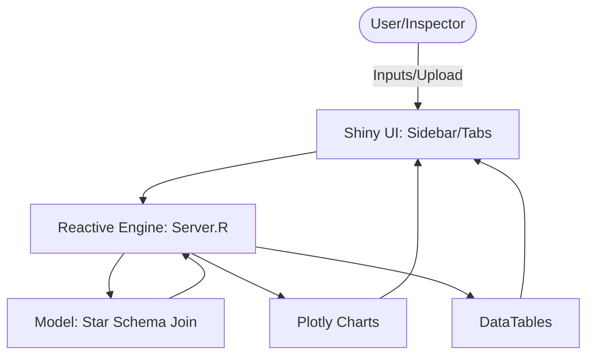

# Solution Design Document (SDD): FACT Shiny Dashboard
## System Name: FACT (FWO Entitlement Analysis & Compliance Tool) - UI/UX Layer

---

## 1. Document Control

| Document Title | FACT Shiny Dashboard — Solution Design Document |
| :--- | :--- |
| Version | 1.0.1 |
| Date | 2024-05-22 |
| Author(s) | B. Kim |
| Reviewer(s) | Lead UI/UX Architect / Analytics Branch |

| Version | Date | Description |
| :--- | :--- | :--- |
| 1.0.1 | 2024-05-22 | Refined UI architecture for Forensic Wage Auditing |

---

## 2. Executive Summary

### Technical Stack
- **Framework:** R Shiny
- **UI Components:** `shinydashboard`, `shinyjs`, `bslib`
- **Visualisation:** `plotly` (Interactivity), `ggplot2` (Static exports)
- **Tables:** `DT` (DataTables with server-side processing)
- **Reactive Engine:** R (Tidyverse)

### Purpose
To provide a high-performance, interactive interface for Fair Work Inspectors to upload payroll data, apply Award-based modeling rules, and visualize underpayment gaps for legal evidence.

### Scope
| In Scope | Out of Scope |
| :--- | :--- |
| Interactive "What-if" parameter tuning | Direct editing of source database records |
| Visual comparison of Actual vs. Expected pay | Automated bank transfers/payments |
| Forensic PDF/Excel report generation | Public-facing employee portal |

---

## 3. Business Context

### Problem Statement
Inspectors struggle to find "the story" in massive spreadsheets. Without a visual tool, it is difficult to identify patterns of systemic wage theft or explain complex calculations to employers/lawyers.

### Objectives
- **Evidence Visualization:** Clearly show the "Gap" between legal requirements and actual payments.
- **Immediate Feedback:** Allow inspectors to change Award Levels and see results instantly.
- **Standardization:** Ensure all inspectors use the same validated calculation engine.

---

## 4. Functional Requirements

| ID | Requirement | Description | Priority |
| :--- | :--- | :--- | :--- |
| FR-UI-01 | Parameter Sidebar | Sidebar to adjust Base Rates, OT thresholds, and Award Levels. | High |
| FR-UI-02 | Reactive Dashboard | KPIs (Total Underpaid, Breach Count) update in real-time. | High |
| FR-UI-03 | Comparison Plot | Overlay bar charts of Expected vs. Actual pay. | High |
| FR-UI-04 | Forensic Table | Drill-down table showing daily-level breakdown of every cent. | Medium |
| FR-UI-05 | Export Module | Button to generate a court-ready PDF report of the current view. | Medium |

---

## 5. Non-Functional Requirements

| Category | Requirement |
| :--- | :--- |
| Performance | Reactive UI elements must update within < 1 second for 50k records. |
| Accessibility | High-contrast themes for WCAG 2.1 compliance (Government standard). |
| Responsiveness | Sidebar must be collapsible to support laptop-screen investigations. |
| Integrity | UI must prevent "impossible" inputs (e.g., negative wage rates). |

---

## 6. High-Level Architecture (Shiny Pattern)



### 6.1 UI Overview
The interface follows a **Master-Detail** pattern. The sidebar controls the "Master" parameters (The Law), while the main body displays the "Detail" (The Evidence).

### 6.2 State Management
The application state is managed via **Shiny Reactivity**. The central state object (`processed_data`) is a reactive expression that re-triggers whenever inputs change.

---

## 7. Detailed Design

### 7.1 Reactive Module: The Engine
*   **Responsibility:** Joins Fact (Timesheets) with Dim (Awards/Rates) and computes deltas.
*   **Trigger:** `input$base_rate`, `input$award_level`, or `input$file_upload`.
*   **Logic:** Vectorized Tidyverse operations.

### 7.2 Visual Module: Plotly Comparison
*   **Type:** Grouped Bar Chart.
*   **X-axis:** Time (Daily Granularity).
*   **Y-axis:** Currency ($ AUD).
*   **Interactivity:** Hover-over to see specific penalty rates applied on that day.

### 7.3 Data Module: DT Forensic Table
*   **Features:** Conditional formatting (Red for Underpaid, Green for Compliant).
*   **Filtering:** Allows searching for specific dates or high-value breaches.

### 7.4 API / Server Logic Example
```R
# Example of Reactive Engine State
final_calculation <- reactive({
  # 1. Fetch Normalised Fact Table
  # 2. Join with Dimension Tables based on UI Selectors
  # 3. Perform Vectorized Math (Expected - Actual)
  # 4. Return Dataframe for Plots and Tables
})
```

---

## 8. Security Design

*   **Session Management:** Auto-timeout after 30 minutes of inactivity to protect sensitive payroll data.
*   **Sanitization:** All file uploads are scanned for malicious scripts; filenames are sanitized.
*   **Local Processing:** Data is processed in-memory and purged upon session end (Privacy by Design).

---

## 9. Error Handling & Fallbacks

| Scenario | Handling Strategy |
| :--- | :--- |
| Uploading non-CSV file | `shinyfeedback` toast notification + Red UI validation message. |
| Negative rate input | `updateNumericInput` to force minimum value of 0. |
| Calculation Error | `tryCatch` block displaying "Error in Award Logic" instead of crashing. |

---

## 10. Observability & Monitoring

*   **Audit Log:** Shiny server logs every "Export Report" action with a timestamp.
*   **Performance Trace:** Using `profvis` during development to identify reactive bottlenecks.

---

## 11. Future Enhancements (Roadmap)

### Short Term
*   **Scenario Comparison:** Side-by-side view of two different Award interpretations.
*   **Interactive Tooltips:** Pop-ups that quote the specific Award clause being applied.

### Long Term
*   **LLM "Explainer":** An AI sidebar that generates a natural language summary of the investigation findings ("The employee was underpaid primarily due to unpaid Sunday penalties...").
