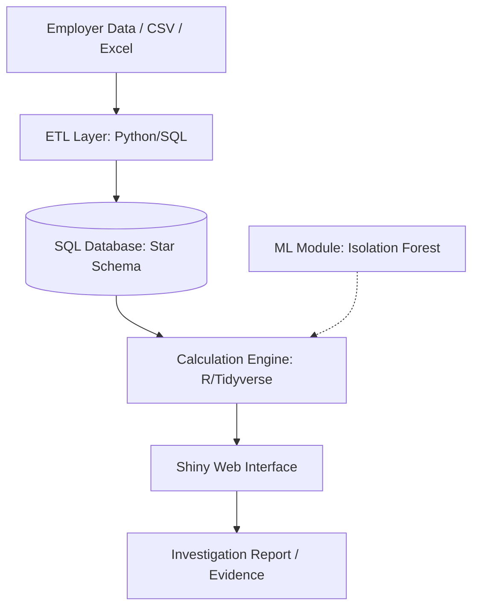

# Solution Design Document (SDD)
## FACT (FWO Entitlement Analysis & Compliance Tool)

---

## 1. Document Control

| Document Title | FACT — Solution Design Document |
| :--- | :--- |
| Version | 1.0.0 |
| Date | 2024-05-22 |
| Author(s) | David Kim (Senior Data Analyst Candidate) |
| Reviewer(s) | Analytics & Intelligence Branch Lead |
| Approver(s) | Regulatory Transformation Group Director |

| Version | Date | Description |
| :--- | :--- | :--- |
| 1.0.0 | 2024-05-22 | Initial architecture for Award-based Wage Analysis System |

---

## 2. Executive Summary

### Technical Stack
- **Frontend/UI:** R Shiny (Interactive Dashboard)
- **Backend/Engine:** R (Tidyverse) & Python (ML Extension)
- **Database:** SQL Server / Snowflake (Star Schema Storage)
- **Infrastructure:** Azure Cloud (Government Tenant)
- **CI/CD & Version Control:** GitHub Actions & Git

### Purpose
본 문서는 고용주의 타임시트 데이터를 분석하여 현대적 급여 체계(Modern Awards) 및 기업 협약(EA) 준수 여부를 자동으로 판별하고 미지급금을 산출하는 **FACT 시스템**의 설계를 기술한다.

### Scope
| In Scope | Out of Scope |
| :--- | :--- |
| 다중 소스 급여 데이터 통합 (ETL) | 실시간 급여 이체 (Payroll Processing) |
| Award 기반 복합 임금 로직 모델링 | 고용주 세무 신고 (Tax/BAS Filing) |
| 미지급금 산출 및 법적 증거 대시보드 | 직원 개인 인사 관리 (HRMS) |

---

## 3. Business Context

### Problem Statement
현행 임금 조사 프로세스는 고용주마다 상이한 데이터 포맷과 수천 페이지에 달하는 복잡한 Award 조항으로 인해 수동 계산 시 오류 발생 가능성이 높고 분석 시간이 과다 소요됨.

### Objectives
- **정확성:** 법적 증거로 활용 가능한 수준의 100% 정확한 임금 산출.
- **효율성:** 자동화된 엔진을 통해 조사 기간을 기존 대비 50% 이상 단축.
- **확장성:** 새로운 Award 및 협약 조항을 코드 수정 없이 데이터 업데이트만으로 수용.

---

## 4. Functional Requirements

| ID | Requirement | Description | Priority |
| :--- | :--- | :--- | :--- |
| FR-01 | Data Normalization | 다양한 포맷의 타임시트를 표준화된 Fact 테이블로 변환 | High |
| FR-02 | Award Modeling | Level, Penalty, OT, Allowance 등 복합 로직 적용 | High |
| FR-03 | Gap Analysis | 실제 지급액과 법정 산출액 비교를 통한 Underpayment 계산 | High |
| FR-04 | What-if Analysis | Award Level이나 시급 변경 시 실시간 결과 재산출 | Medium |
| FR-05 | Anomaly Detection | 인위적으로 조작된 타임시트 패턴 탐지 (ML) | Medium |

---

## 5. Non-Functional Requirements

| Category | Requirement |
| :--- | :--- |
| Performance | 100만 건 이상의 행 처리 시 결과 도출까지 10초 이내 |
| Scalability | Star Schema 설계를 통해 대규모 사업장(직원 1만 명+) 분석 지원 |
| Reliability | 모든 계산 로직에 대한 Audit Trail(추적 가능성) 제공 |
| Security | Baseline Clearance 기준의 데이터 암호화 및 PII 마스킹 처리 |
| Usability | 비기술적 조사관(Inspector)이 사용 가능한 직관적 GUI 제공 |

---

## 6. High-Level Architecture



### 6.1 System Overview
본 시스템은 데이터 수집(ETL), 저장(Star Schema), 연산(Engine), 시각화(Shiny)의 4단계 파이프라인으로 구성된다.

### 6.2 Data Flow
1. **Raw Input:** 고용주의 비정형 타임시트 데이터 로드.
2. **Dimension Mapping:** 직원 정보(Dim_Emp) 및 Award 규정(Dim_Award) 매핑.
3. **Fact Table Logic:** 일 단위 입도(Daily Granularity)로 정상/초과/페널티 시간 계산.
4. **Output:** 최종 미지급금 합계 및 상세 내역을 대시보드에 투영.

### 6.3 Key Components
| Component | Description |
| :--- | :--- |
| Ingestion Module | 다중 포맷 데이터를 표준 스키마로 변환하는 Validator 포함 |
| Compliance Engine | R의 벡터화 연산을 이용한 Award 로직 연산 핵심 모듈 |
| Risk Scorer | XGBoost 기반의 위반 확률 예측 모듈 (ML Extension) |

---

## 7. Detailed Design

### 7.1 Data Modeling (Star Schema)
* **Fact_Timesheets:** `date_id`, `emp_id`, `start_time`, `end_time`, `actual_paid`
* **Dim_Awards:** `award_id`, `ot_threshold`, `break_rule`, `allowances`
* **Dim_PayRates:** `award_id`, `level`, `day_type`, `base_rate`, `multiplier`

### 7.2 Calculation Module
* **책임:** 법정 근로 조건에 따른 `expected_pay` 산출
* **입력:** Normalised Timesheet + Award Parameters
* **출력:** Daily Underpayment Amount

### 7.3 State Management (Shiny Reactive)
```R
# Shiny Reactive State Example
processed_data <- reactive({
  req(input$file)
  data <- read.csv(input$file$datapath)
  calculate_compliance(data, input$base_rate_slider)
})
```

---

## 8. Security Design
* **인증/인가:** Azure AD 기반 Role-Based Access Control (RBAC).
* **데이터 보호:** TDE(Transparent Data Encryption) 및 전송 중 TLS 1.2 암호화.
* **입력 검증:** 파일 업로드 시 Schema Validation 및 SQL Injection 방지 처리.
* **PII 관리:** 분석에 불필요한 개인정보(TFN, 주소 등)는 수집 단계에서 마스킹.

---

## 9. Error Handling & Fallbacks

| Scenario | Handling Strategy |
| :--- | :--- |
| 데이터 누락 (Null Time) | 해당 레코드를 Error Log에 기록하고 계산에서 제외 (User Alert) |
| Award 조항 충돌 | 최우선 순위(Highest Rate) 조항 적용 후 조사관 검토 마킹 |
| 시스템 과부하 | 비동기 처리(Async) 및 Batch Job 전환 안내 |

---

## 10. Observability & Monitoring
* **Logging:** 모든 계산 로그를 `audit_log` 테이블에 기록 (누가, 언제, 어떤 로직으로 계산했는지).
* **Metrics:** 분석 성공률, 평균 처리 시간, 탐지된 미지급금 총액.
* **Health Check:** `/health` 엔드포인트를 통한 DB 및 R 엔진 상태 모니터링.

---

## 11. Future Enhancements (Roadmap)

### Short Term
- **NLP Integration:** PDF 협약 문서에서 텍스트를 추출하여 `Dim_Awards` 자동 업데이트.
- **API Access:** 타 부서(Litigation)에서 분석 결과를 직접 쿼리할 수 있는 API 개방.

### Long Term
- **Predictive Targeting:** ML을 통해 미지급 발생 가능성이 높은 산업군/지역을 선제적으로 예보.
- **Collaborative Review:** 조사관들이 대시보드 상에서 실시간 주석을 달고 협업하는 기능.


